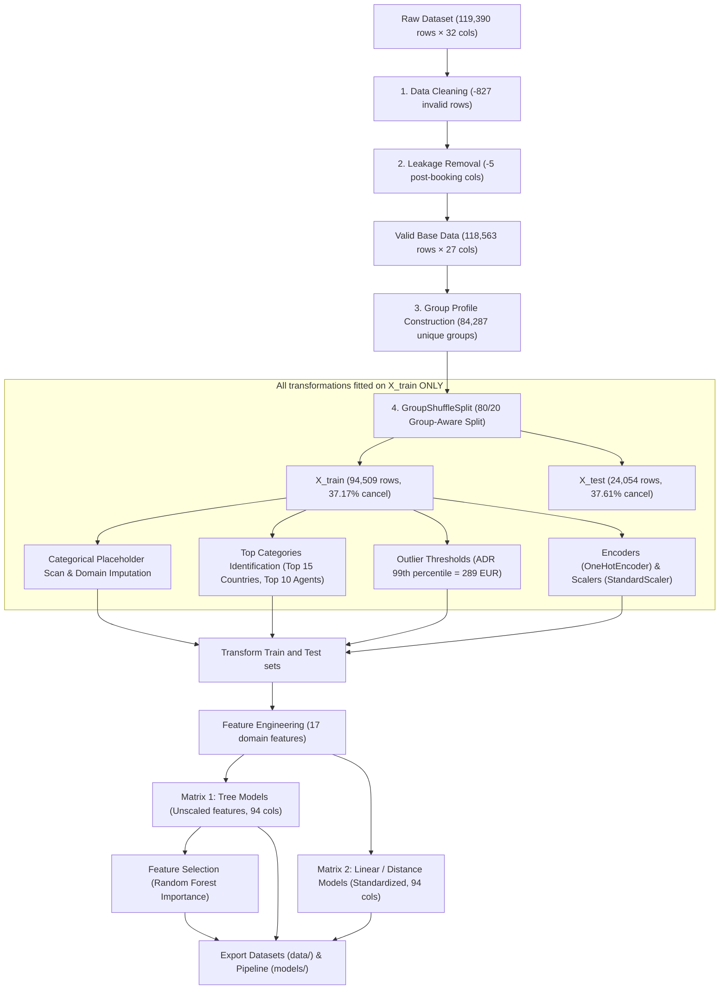

# IT3051 – Fundamentals of Data Mining (FDM)
# Data Preprocessing & Feature Engineering Report

**Project Title:** Hotel Revenue Management & Cancellation Risk Prediction System  
**Dataset:** Hotel Booking Demand (`hotel_bookings.csv` – Antonio, de Almeida, & Nunes, 2019)  
**Target Variable:** `is_canceled` (0 = Stayed / Checked-out, 1 = Canceled / No-Show)  
**Notebook:** [FDM_Stage4_Preprocessing_FeatureEngineering.ipynb](file:///c:/Users/kavis/OneDrive/Desktop/FDM/project/FDM_Stage4_Preprocessing_FeatureEngineering.ipynb)

---

## 1. Overview & Preprocessing Pipeline

This report documents our complete data preprocessing and feature engineering workflow. The goal is to prepare the raw hotel bookings data for machine learning modeling (Stage 6) while preventing any form of data leakage and ensuring that all features would realistically be available at booking creation time.

---

## 2. Data Cleaning: Removing Invalid Records

We identified and dropped **827 invalid records (0.69%)** that represent physically impossible stays or system errors:

| Condition | Row Count | Justification |
| :--- | :---: | :--- |
| **Zero Guests** (`adults + children + babies == 0`) | **180** | A hotel room cannot be occupied without guests. These represent software test entries or aborted bookings. Imputing values would inject false demographic signals. |
| **Zero Nights Stay** (`weekend_nights + week_nights == 0`) | **715** | In hotel PMS accounting, zero-duration bookings with ADR=0 represent non-stay administrative passes or conference room holds rather than lodging demand. |
| **Negative Room Rate** (`adr < 0`) | **1** | Room rates cannot be negative (`-6.38 EUR`). This is an accounting refund reversal entry. |
| **Extreme Room Rate Typo** (`adr > 1000`) | **1** | A single record with `ADR = 5,400.0 EUR` for 1 adult in a standard Room A (where standard rates are ~100–200 EUR). This single typo severely distorts linear model loss gradients. |
| **Total Unique Invalid Rows Dropped** | **827** | Net unique invalid rows removed (accounting for overlapping conditions). Valid rows remaining: **118,563**. |

---

## 3. Duplicate Records Analysis: Retaining Group Bookings via Group-Aware Splitting

The cleaned data contains **31,926 duplicate records (26.93%)**. In exploratory data analysis, we investigated their origin and evaluated the strategic trade-offs of deduplication versus retention.

### Why Duplicates Exist in This Dataset
Over 72% of duplicate records come from two market segments:
- **Groups:** 41.73%
- **Offline TA/TO:** 30.41%

These rows represent tour operators, wedding blocks, and conference organizers booking blocks of 10 to 50 identical rooms (same arrival date, lead time, room type, rate, and meal plan). When researchers anonymized the dataset (*Antonio et al., 2019*), all personal identifiers (guest names, reservation IDs, credit card numbers, phone numbers) were stripped out. Consequently, separate, genuine bookings within a group block naturally appear identical across all remaining columns.

### The Problem with Blind Deduplication
1. **Loss of Real Signal:** Blindly dropping 31,926 records discards genuine group reservations, disproportionately penalizing group bookings—one of the primary operational concerns of the Reservations Department.
2. **Artificial Cancellation Rate Shift:**
   - Full valid data (with duplicates): **37.26%** cancellation rate.
   - Deduplicated data: **27.49%** cancellation rate.
   - Deleting duplicates creates an artificial ~10 percentage point downward shift in cancellation baseline because group blocks experience correlated block cancellations.

### The Solution: Group-Aware Train/Test Split (`GroupShuffleSplit`)
To retain these genuine group bookings while strictly preventing train/test data leakage (pseudo-replication):
1. We grouped all identical booking profiles across all predictor columns using `X.groupby(list(X.columns), dropna=False).ngroup()`, yielding **84,287 unique booking profile groups**.
2. We partitioned the data using `GroupShuffleSplit(n_splits=1, test_size=0.20, random_state=42)`:
   - **`X_train`:** 94,509 rows (79.71%) — cancellation rate: **37.17%**
   - **`X_test`:** 24,054 rows (20.29%) — cancellation rate: **37.61%**
3. **Cross-Split Overlap Verification:** We verified that the intersection between training group IDs and test group IDs is **strictly 0**. No duplicate booking profile appears in both sets, guaranteeing zero data leakage while preserving the complete group booking signal.

---

## 4. Preventing Data Leakage

Our objective is to predict cancellation risk **at the time of booking creation**. We eliminated 5 features that are not available at that time:

1. **`reservation_status` & `reservation_status_date`:** Direct target outcome leakage. `reservation_status` has 100% correlation with `is_canceled` (`'Check-Out'` vs `'Canceled'/'No-Show'`), and `reservation_status_date` is logged at checkout or cancellation.
2. **`assigned_room_type`:** Room assignment occurs at check-in. In EDA, guests who received a room upgrade had only a **5.4%** cancellation rate (vs **41.6%** when unchanged), because only guests who physically arrive can receive a front-desk room reassignment.
3. **`booking_changes`:** Modifications made between booking creation and check-in. At reservation time, modifications are always zero.
4. **`days_in_waiting_list`:** Waiting time accrued after booking creation while awaiting room confirmation (>97% are 0).

---

## 5. Missing Value & Hidden Placeholder Imputation

We programmatically scanned all categorical columns in `X_train` for hidden placeholder strings (`'Undefined'`, `'Unknown'`, `'?'`, `'None'`, `'-'`). Imputation was computed strictly on `X_train`:

| Feature | Missing / Placeholder Count in $X_{\text{train}}$ | Imputation Strategy & Domain Reason |
| :--- | :---: | :--- |
| **`company`** | **88,881 (94.0%)** | Missing company indicates a **private individual booking** (not billed to a corporate account). Imputed with `0` and created binary flag `has_company`. Corporate bookings cancel only **10.89%** of the time vs **28.75%** for non-corporate. |
| **`agent`** | **12,969 (13.7%)** | Missing agent indicates a **direct booking** made without travel agency intermediation. Imputed with `0` (`'Direct'`) and created `has_agent`. |
| **`country`** | **381 (0.4%)** | Imputed with `'Unknown'` prior to grouping. |
| **`children`** | **4 (<0.01%)** | Imputed with the training median (`0.0`). |
| **`meal == 'Undefined'`** | **938 rows (0.99%)** | Mapped to `'SC'` (Self-Catering / no meal package), as confirmed in the dataset paper (*Antonio et al., 2019*). |
| **`market_segment` / `distribution_channel`** | **2 and 5 rows** | Replaced `'Undefined'` with training set modes (`'Online TA'` and `'TA/TO'`). |

---

## 6. Feature Engineering

We created **17 domain features** to capture customer commitment, pricing dynamics, and seasonality:

| Feature | Formulation | Domain Rationale | Empirical Correlation |
| :--- | :--- | :--- | :---: |
| **`lead_time_log`** | $\ln(1 + \text{lead\_time})$ | Compresses severe right skewness (0–737 days) into near-Gaussian form. | Linear correlation increases from **+0.1835 → +0.2382** (+30% gain) |
| **`cancellation_ratio`** | $\frac{\text{previous\_cancellations}}{\text{total\_prev\_bookings} + 1}$ | Laplace-smoothed historical cancellation reliability; normalizes cancellation count by booking frequency. | Correlation increases from **+0.0514 → +0.1617** (>3x gain) |
| **`has_parking_space`** | $\mathbb{I}(\text{parking\_spaces} > 0)$ | Guests driving personal/rental cars to the hotel have high commitment and rarely cancel. | **r = -0.1875** (Strongest protective signal) |
| **`has_special_requests`**| $\mathbb{I}(\text{special\_requests} > 0)$ | Active guest personalization indicates intentional travel plans and lower cancellation propensity. | **r = -0.1302** |
| **`has_company`** | $\mathbb{I}(\text{company} \neq 0)$ | Corporate business traveler indicator with company-backed billing. | **r = -0.0946** |
| **`has_agent`** | $\mathbb{I}(\text{agent} \neq 0)$ | Intermediated agency booking vs direct individual booking. | **r = +0.1324** |
| **`total_stay_nights`** | $\text{weekend\_nights} + \text{week\_nights}$ | Total duration of the stay. | **r = +0.0813** |
| **`weekend_stay_ratio`** | $\frac{\text{weekend\_nights}}{\max(\text{total\_stay\_nights}, 1)}$ | Distinguishes leisure weekend travelers from midweek business travelers. | Behavioral factor |
| **`adr_per_person`** | $\frac{\text{adr}}{\max(\text{total\_guests}, 1)}$ | Room rate normalized per guest. | **r = +0.0474** |
| **`is_family`** | $\mathbb{I}((\text{children} + \text{babies}) > 0)$ | Family travel flag (less flexible travel schedules). | **r = +0.0513** |
| **`is_alone`** | $\mathbb{I}(\text{total\_guests} == 1)$ | Solo traveler flag. | **r = -0.0877** |
| **`arrival_month_sin` / `cos`** | $\sin / \cos\left(\frac{2\pi \cdot m}{12}\right)$ | Cyclical trigonometric encoding; ensures December (12) and January (1) are continuous in feature space. | Continuous seasonality |
| **`arrival_season`** | Winter, Spring, Summer, Autumn | High season (Algarve / Lisbon summer peaks) vs off-season. | Categorical factor |

---

## 7. Categorical Encoding & High-Cardinality Grouping

### High-Cardinality Grouping
- **`country` (177 unique countries):** Direct one-hot encoding would add 177 columns, causing extreme sparsity and overfitting on rare countries. The **Top 15 countries account for >89% of all bookings** (Portugal, Great Britain, France, Spain, Germany, Italy, Ireland, Belgium, Brazil, Netherlands, USA, Switzerland, China, Austria, Sweden). We kept these top 15 from `X_train` and collapsed the remaining countries into `'Other'`.
- **`agent` (333 unique IDs):** The **Top 10 travel agents account for >77% of all agency bookings** (Agent 9 represents major OTAs like Booking.com/Expedia). We mapped the top 10 agents to individual category tokens (`'Agent_9'`, `'Agent_240'`), remaining agents to `'Other_Agent'`, and direct bookings to `'Direct'`.

### One-Hot Encoding
All 10 nominal categorical features were encoded using `OneHotEncoder(handle_unknown='ignore')` fitted strictly on `X_train`:
- Low-cardinality: `hotel` (2), `meal` (4), `market_segment` (7), `distribution_channel` (4), `reserved_room_type` (9), `deposit_type` (3), `customer_type` (4), `arrival_season` (4).
- Grouped: `country_grouped` (16), `agent_grouped` (12).
- **Total one-hot encoded dummy columns:** **65 categories** (yielding **94 total features** combined with 29 numeric features).

---

## 8. Outlier Treatment & Dual Preprocessing Pipelines

Different machine learning algorithms require different feature representations:

1. **Unscaled Tree Matrix (`X_train_tree`, `X_test_tree` – 94 features):**
   - **For Decision Tree, Random Forest, XGBoost.**
   - Decision trees make orthogonal split decisions based on rank order ($x_i \le \theta$). They are invariant to monotonic scaling and extreme values. Keeping unscaled features preserves physical interpretability (e.g. lead time in days, ADR in EUR).
2. **Standardized Linear/Distance Matrix (`X_train_scaled`, `X_test_scaled` – 94 features):**
   - **For Logistic Regression, KNN, Support Vector Machines, Neural Networks.**
   - These algorithms compute dot products and Euclidean distances, making them sensitive to feature scale.
   - We capped guest counts to single-room capacity (`adults <= 4`, `children <= 3`, `babies <= 2`).
   - We Winsorized ADR at the 99th percentile (**289.0 EUR**, fitted on `X_train`).
   - We applied `StandardScaler` to ensure zero mean and unit variance.

---

## 9. Feature Selection (Top Predictors)

Using Random Forest feature importance, we evaluated the relative predictive power of all 94 features:

| Rank | Feature | Category | Importance Score |
| :---: | :--- | :--- | :---: |
| **1** | `deposit_type_No Deposit` | Booking Policy | **0.1386** |
| **2** | `deposit_type_Non Refund` | Booking Policy | **0.1166** |
| **3** | `country_grouped_PRT` | Geographic Market | **0.0884** |
| **4** | `lead_time_log` | Engineered Booking Horizon | **0.0584** |
| **5** | `lead_time` | Raw Booking Horizon | **0.0479** |
| **6** | `cancellation_ratio` | Engineered Loyalty Reliability | **0.0474** |
| **7** | `total_of_special_requests` | Service Demand | **0.0418** |
| **8** | `has_previous_cancellation` | Historical Loyalty Flag | **0.0395** |
| **9** | `agent_grouped_Agent_9` | Major OTA ID | **0.0388** |
| **10** | `has_special_requests` | Engineered Binary Service | **0.0364** |

The Top 30 features were saved to [selected_features.json](file:///c:/Users/kavis/OneDrive/Desktop/FDM/project/models/selected_features.json) to support feature ablation experiments in Stage 7.

---

## 10. Prepared Datasets & Pipeline Artifacts

All processed datasets and configuration files are generated and ready for Stage 6 modeling:

- `data/X_train_tree.csv` & `data/X_test_tree.csv`: 94,509 train and 24,054 test rows (94 unscaled features for tree models).
- `data/X_train_scaled.csv` & `data/X_test_scaled.csv`: 94,509 train and 24,054 test rows (94 standardized features for linear/distance models).
- `data/y_train.csv` & `data/y_test.csv`: Ground truth cancellation labels.
- `models/preprocessor_pipeline.joblib`: Serialized Scikit-Learn transformer bundle for the backend API (Stage 9).
- `models/selected_features.json`: Top 30 features list for Stage 7 ablation testing.

---

## 11. Key Preprocessing Decisions & Viva Preparation Notes

These bullet points summarize our decisions for the individual viva evaluation:

- **Why remove invalid records instead of imputing?** Zero-guest rows are system test records, and zero-night rows are administrative day passes with ADR=0. Imputing values would invent false customer demographics.
- **Why retain duplicates with a group-aware split instead of blindly dropping them?** Over 72% of duplicates belong to `Groups` and `Offline TA/TO` tour blocks that look identical because guest names were anonymized. Blindly dropping them deletes real group reservations and shifts the baseline cancellation rate by nearly 10 percentage points (from 37.26% to 27.49%). By using `GroupShuffleSplit` on identical booking profiles, we retain the entire group booking signal while ensuring 0 group overlap between train and test sets, strictly preventing cross-split data leakage.
- **Why remove `assigned_room_type` and `booking_changes`?** In hotel operations, room reassignments happen at check-in (only arriving guests get upgraded, leading to an artificially low 5.4% cancellation rate), and booking changes accumulate over time (always 0 at reservation time). Using them causes operational lookahead leakage.
- **Why impute `company` and `agent` with 0?** In hotel PMS, missing values mean direct/individual bookings. Corporate bookings have a very low cancellation rate (10.9% vs 28.8% for non-corporate). Creating binary indicator flags captures this valuable signal without high-cardinality ID sparsity.
- **Why group countries and agents?** Collapsing 177 countries (top 15 cover >89%) and 333 agents (top 10 cover >77%) prevents dimensionality explosion and avoids overfitting on countries with only 1 or 2 historical visits.
- **Why create two feature matrices?** Trees split on rank ordering and are invariant to scale, so unscaled features preserve business interpretability. Linear and distance models compute dot products and Euclidean distances, requiring 99th-percentile Winsorization and standard scaling.
